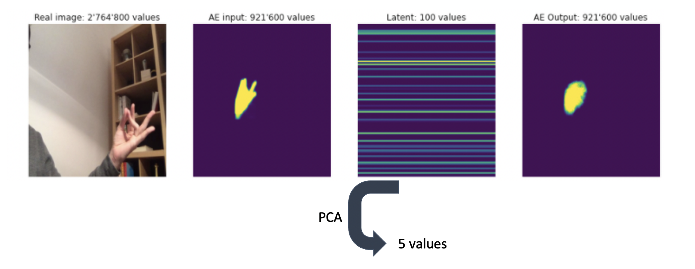

# Gesture Demo
[](https://github.com/PedroFerreiradaCosta/FaceFitOpt/blob/master/LICENSE)
[](https://colab.research.google.com/gist/PedroFerreiradaCosta/4b6cf7dde3d985e6fc082f39db872628/gesturedemo.ipynb) 
[](https://github.com/PedroFerreiradaCosta/GestureLearner/blob/main/GestureDemo.ipynb)

This project is a proof-of-concept of model
 that is able  to classify any gesture with
  one or multiple hands without  needing to
   be trained on a specific label. I do so, by 
   creating an exhaustive latent space of hand 
   gestures where you only need one example to 
   define a class and measure it towards other
   examples by finding its Euclidean distance.
   This project lies  in the intersection of interaction 
   and human-in-the-loop machine learning.
   
   This project is implemented in PyTorch.



## Getting Started
[Click here to see the proof-of-concept on a Colab notebook.](https://colab.research.google.com/gist/PedroFerreiradaCosta/4b6cf7dde3d985e6fc082f39db872628/gesturedemo.ipynb)

____

To train a similar model, follow these instructions that 
will get you a copy of the project up and running on your
 local machine for development and testing purposes. See
  deployment for notes on how to deploy the project on a live system.

### Installing 
Download repo
```
git clone https://github.com/PedroFerreiradaCosta/GestureLearner.git
cd GestureLearner
```
Install virtualenv and creating a new virtual environment:
```
pip install virtualenv
virtualenv -p /usr/bin/python3 ./venv
```
Install dependencies
```
pip3 install -r requirements.txt
```
## Author
* **Pedro F da Costa** - [Website](http://pedroferreiradacosta.github.io/) - [CV](https://pedroferreiradacosta.github.io//assets/CV_Pedro_daCosta.pdf) 

## Acknowledgments
This work adapted code from:
* https://pytorch.org/tutorials/beginner/finetuning_torchvision_models_tutorial.html
* https://www.kaggle.com/ljlbarbosa/convolution-autoencoder-pytorch
* https://github.com/molyswu/hand_detection
